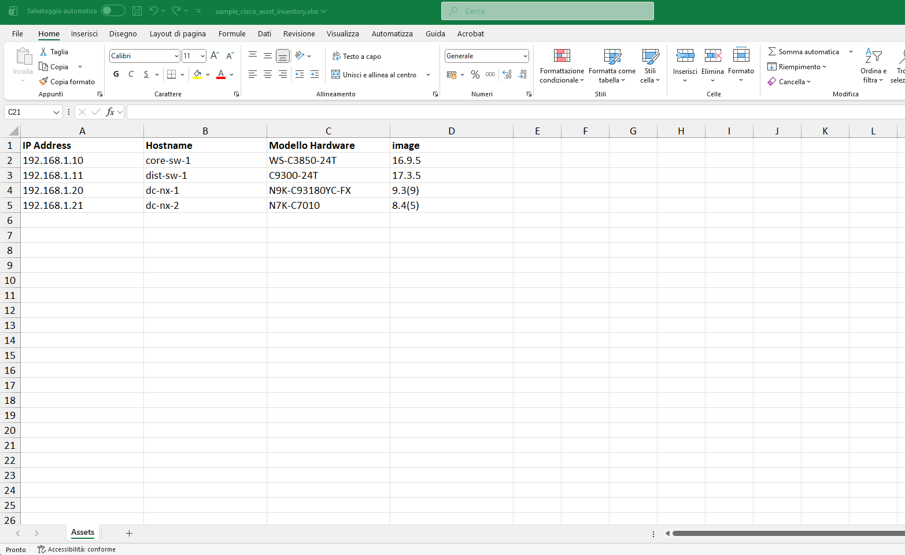
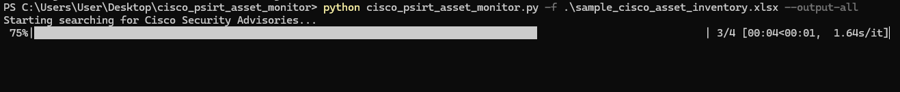
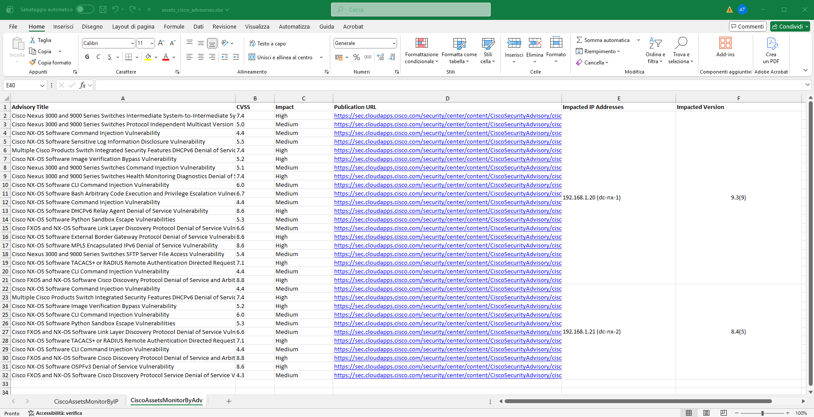
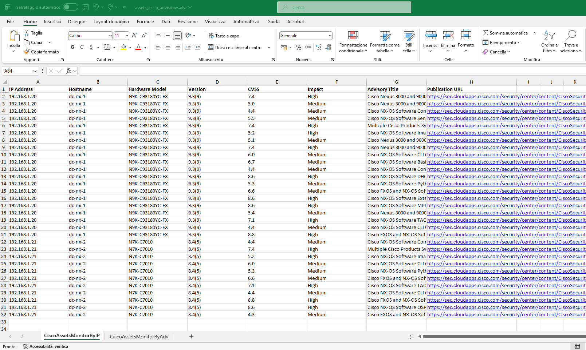

# Cisco PSIRT Asset Monitor

> **Disclaimer**  
> This is a **refactored version** of a script originally developed in **2020**.  
> The code has been updated and tested against the current Cisco PSIRT openVuln v2 API and modern Python libraries, but the original logic and data model come from that earlier implementation.

This python script was used during **vulnerability management activities**, where the network security team provided a large Excel file with an inventory of Cisco assets. The goal was to quickly identify relevant security vulnerabilities when:

- Not all devices could be scanned with a VA scanner (e.g. Nessus), or  
- Scanner coverage was incomplete

The script:

1. Reads an Excel asset inventory (IP, hostname, hardware model, image/version).  
2. Queries Cisco PSIRT openVuln for each distinct IOS / NX-OS version.  
3. Builds an output Excel file mapping assets to advisories, either:
   - grouped by **IP address**, or  
   - grouped by **advisory**, with impacted IPs and versions clearly listed.

---

## Command-Line Help

The script provides a standard CLI help message:

```bash
python cisco_psirt_asset_monitor.py -h
```

Example output:

```text
usage: CiscoAssetsMonitor [-h] -f INVENTORY.xlsx [--output-by-adv] [--output-by-ip] [--output-all]

Query Cisco PSIRT APIs (IOS / NX-OS) for security advisories based on an Excel asset inventory.

options:
  -h, --help            show this help message and exit
  -f INVENTORY.xlsx, --file INVENTORY.xlsx
                        Path to the Excel asset inventory file. The first sheet will be parsed and the first row must contain column headers.
  --output-by-adv       Generate an .xlsx sheet grouped by advisory, with merged rows for impacted IP addresses and versions. Default if no output option is provided.
  --output-by-ip        Generate an .xlsx sheet grouped by IP address (advisories may be repeated across rows).
  --output-all          Generate both output formats in a single .xlsx file (one sheet per view).

Examples:
  python3 CiscoAssetsMonitor.py -f inventory.xlsx --output-by-adv
  python3 CiscoAssetsMonitor.py -f inventory.xlsx --output-by-ip
  python3 CiscoAssetsMonitor.py -f inventory.xlsx --output-all

The input Excel file must have at least these columns:
  - 'IP Address'        (device IP)
  - 'Hostname'          (device hostname)
  - 'Modello Hardware'  (hardware model)
  - 'image'             (Cisco IOS/NX-OS image or version)
```

---

## Screenshots

- **Sample input Excel**

  `sample_cisco_asset_inventory.xlsx` – example structure:

  

- **Script execution**

  

- **Generated output Excel (CiscoAssetsMonitorByAdv Sheet)**

  `assets_cisco_advisories.xlsx` – “By advisory” sheets:

  

- **Generated output Excel (CiscoAssetsMonitorByIP Sheet)**

  `assets_cisco_advisories.xlsx` – “By IP” sheet:

  
---

## Input Excel Format

The script expects an Excel file where the **first row is the header** and the first sheet contains at least the following columns (names must match exactly):

- `IP Address`        – device IP address  
- `Hostname`          – device hostname  
- `Modello Hardware`  – hardware model (e.g. `C9300-24T`)  
- `image`             – Cisco OS version or image (e.g. `17.3.5` or `9.3(9)`)

An example file is included:

- `sample_cisco_asset_inventory.xlsx`

---

## Getting Started

### 1. Clone the repository

```bash
git clone https://github.com/1r0ncut/cisco_psirt_asset_monitor.git
cd cisco_psirt_asset_monitor
```

### 2. Create a virtual environment (recommended)

```bash
python -m venv venv
source venv/bin/activate            # Linux/macOS
# or
venv\Scripts\activate             # Windows
```

### 3. Install Python dependencies

```bash
pip install -r requirements.txt
```


### 4. Create a Cisco PSIRT API application and get credentials

1. Log in to the Cisco API Console / DevNet (apiconsole.cisco.com).  
2. Create a **new application** for the **Cisco PSIRT openVuln API (v2)**:
   - Application type: `Service`
   - Grant type: `Client Credentials`
3. Enable the **Cisco PSIRT openVuln** / Security Advisories API.
4. Copy:
   - **Key** → this is your `client_id`
   - **Client Secret** → this is your `client_pass`

### 5. Configure the script with your credentials

Edit `cisco_psirt_asset_monitor.py` and set:

```python
client_id = "YOUR_APP_KEY"
client_pass = "YOUR_APP_CLIENT_SECRET"
```

### 6. Prepare your asset inventory

You can either:

- Use the provided `sample_cisco_asset_inventory.xlsx`, or  
- Create your own file with the required columns (`IP Address`, `Hostname`, `Modello Hardware`, `image`).

### 7. Run the script

Basic example (default output = grouped by advisory):

```bash
python cisco_psirt_asset_monitor.py -f sample_cisco_asset_inventory.xlsx
```

Generate both views (by IP and by advisory) in the same output file:

```bash
python cisco_psirt_asset_monitor.py -f sample_cisco_asset_inventory.xlsx --output-all
```

Generate only the view grouped by IP:

```bash
python cisco_psirt_asset_monitor.py -f sample_cisco_asset_inventory.xlsx --output-by-ip
```

### 8. Inspect the output

The script will create:

- `assets_cisco_advisories.xlsx`

with one or two sheets:

- `CiscoAssetsMonitorByIP`    – rows per IP/advisory  
- `CiscoAssetsMonitorByAdv`   – rows per advisory, merged cells listing impacted IPs and versions
